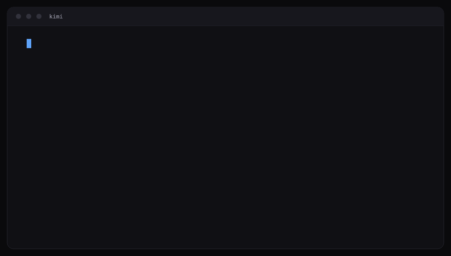
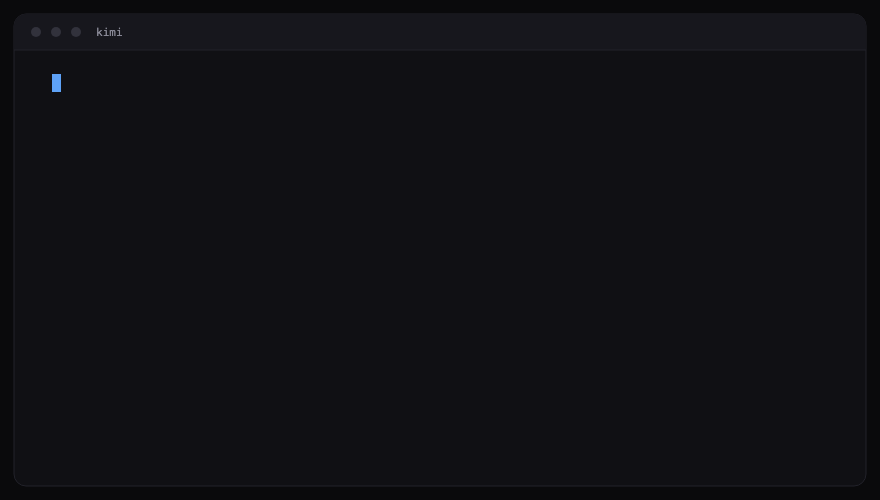

# Kimi SEO

**Kimi SEO is an open-source SEO analysis plugin for Kimi Code (Moonshot AI).** It runs 25 sub-skills and 18 specialist agents in parallel across technical SEO, content quality (E-E-A-T), Schema.org markup, AI search optimization (GEO), local SEO, e-commerce, and international SEO. Every audit produces a prioritized action plan with testable recommendations grounded in primary-source guidance from Google.

[](https://github.com/AgriciDaniel/claude-seo)
[](https://github.com/bentocodeing/kimi-seo/actions/workflows/ci.yml)
[](https://www.kimi.com)
[](LICENSE)
[](https://github.com/bentocodeing/kimi-seo/releases)
[](tests/)

> **Kimi SEO is a fork of [`AgriciDaniel/claude-seo`](https://github.com/AgriciDaniel/claude-seo)**, adapted for [Kimi Code](https://www.kimi.com) (Moonshot AI). All credit for the original SEO workflow goes to [@AgriciDaniel](https://github.com/AgriciDaniel) and the [upstream contributors](CONTRIBUTORS.md). The `main` branch tracks upstream releases; the `kimi` branch carries the Kimi rebrand and adaptations.

### Why Kimi SEO

- **AI-search first.** Aligned with [Google's AI Optimization Guide](https://developers.google.com/search/docs/fundamentals/ai-optimization-guide). Question-based citability scoring, primary-source evidence on llms.txt, IPTC `TrainedAlgorithmicMedia` for AI-generated product images, agent-friendly page checks per [web.dev](https://web.dev/).
- **Parallel execution.** Full site audits spawn up to 15 specialist agents simultaneously. Site-level audits complete in minutes rather than hours.
- **Falsifiable, not promotional.** Every recommendation carries the first-principle observation it rests on, its dependency relationships, an explicit "how would we know this failed?" check, and a leading indicator. See [Methodology](#methodology).

### Real results


Google Search Console for a site started 23 March 2026 and run on this workflow: total clicks and impressions across its first three months, through 12 June 2026.

## Who this is for

- **SEO agencies running 5+ client sites.** Replace quarterly deep audits with weekly automated runs. Same team capacity, 4× audit cadence, every recommendation comes with a falsifiability check the client can verify.
- **In-house SEO leads at SaaS / publisher / e-commerce companies.** Second-pair-of-eyes before executive reviews. Catches what GSC and Lighthouse hide: schema deprecation, AI-citability gaps, expired-domain heritage risk, parasite-SEO exposure, machine-translation drift.
- **Freelance SEO consultants.** Anchor day-one client scope with a 15-minute audit and a real 0-100 score. Win the engagement with concrete proof of value before you spend an hour writing the proposal.



Run a full audit and watch parallel agents fan out across the site:



## Table of Contents

- [Who this is for](#who-this-is-for)
- [Installation](#installation)
- [Quick Start](#quick-start)
- [Getting Started guide](docs/GETTING-STARTED.md)
- [Commands](#commands)
- [Features](#features)
- [Compared to manual / agency / commercial tools](#compared-to-manual--agency--commercial-tools)
- [Use cases](#use-cases)
- [Sample Output](#sample-output)
- [Architecture](#architecture)
- [Methodology](#methodology)
- [Limitations](#limitations)
- [Requirements](#requirements)
- [Uninstall](#uninstall)
- [Extensions](#extensions)
- [Ecosystem](#ecosystem)
- [Documentation](#documentation)
- [FAQ](#faq)
- [Community Contributors](#community-contributors)
- [License](#license)
- [Contributing](#contributing)
- [Author](#author)

## Installation

> ℹ️ **You are on the Kimi fork.** The commands below install from [`bentocodeing/kimi-seo`](https://github.com/bentocodeing/kimi-seo) — MIT, public releases, no membership required. Upstream project: [`AgriciDaniel/claude-seo`](https://github.com/AgriciDaniel/claude-seo).

### Plugin Install (Kimi Code, recommended)

Inside Kimi Code, install this fork directly from GitHub:

```
/plugins install https://github.com/bentocodeing/kimi-seo
/reload
/kimi-seo:seo setup
```

The plugin manager copies the repo to Kimi Code's managed plugins directory and loads `kimi.plugin.json`: all 25 skills, the session-start orientation skill, and the schema-validation hook. `/kimi-seo:seo setup` is an explicit, one-time provisioning step for the isolated Python runtime.

### Manual Install (Unix / macOS / Linux)

For a git-checkout install into `~/.kimi-code/skills/` and `~/.agents/agents/`:

```bash
git clone --depth 1 --branch kimi https://github.com/bentocodeing/kimi-seo.git
bash kimi-seo/install.sh
```

<details>
<summary>One-liner (curl, review then run)</summary>

```bash
curl -fsSL https://raw.githubusercontent.com/bentocodeing/kimi-seo/kimi/install.sh > install.sh
cat install.sh        # review before running
bash install.sh
rm install.sh
```

</details>

### Windows (PowerShell)

```powershell
git clone --depth 1 --branch kimi https://github.com/bentocodeing/kimi-seo.git
powershell -ExecutionPolicy Bypass -File kimi-seo\install.ps1
```

> **Why `git clone` instead of `irm | iex`?** Kimi Code's own security guardrails flag `irm ... | iex` as a supply chain risk: downloading and executing remote code without verification. The `git clone` approach lets you inspect `kimi-seo\install.ps1` before running it.

## Quick Start

> **New here?** Read [Getting Started](docs/GETTING-STARTED.md) first —
> install to first fixed issue in about 10 minutes. Mental model: `audit`
> is the all-in-one diagnosis (it runs most specialists for you); the other
> commands are focused re-checks and generators you use while fixing; and
> **no API keys are required** for any of it.

> **Invocation in Kimi Code:** the commands below are written in their
> documentation shorthand `/kimi-seo:seo ...`. In the CLI, run them through the plugin
> slash command — `/kimi-seo:seo audit https://example.com` — or via
> `/skill:seo audit https://example.com`. You can also simply describe what
> you need in natural language ("audit example.com") — the `seo` orchestrator
> skill routes the request automatically. Every audit writes its artifacts
> (`FULL-AUDIT-REPORT.md`, `ACTION-PLAN.md`, `audit-data.json`, `findings/`,
> `screenshots/`) into a `{domain}-audit/` folder in your current project.

```bash
# Start Kimi Code
kimi

# Full site audit: parallel sub-agents produce a prioritized action plan
/kimi-seo:seo audit https://example.com

# Deep single-page analysis: on-page elements, content quality, schema
/kimi-seo:seo page https://example.com/about

# Schema markup audit: detect, validate, generate
/kimi-seo:seo schema https://example.com

# AI search optimization: passage citability + primary-source-aligned recommendations
/kimi-seo:seo geo https://example.com

# Generate a sitemap with industry templates
/kimi-seo:seo sitemap generate
```

## Commands



32 user-invocable `/kimi-seo:seo` commands across the orchestrator, its sub-skills, and 8 MCP extensions. Full reference in [docs/COMMANDS.md](docs/COMMANDS.md).

| Command | Description |
|---------|-------------|
| `/kimi-seo:seo setup` | Create or refresh the isolated Python runtime and Chromium |
| `/kimi-seo:seo doctor` | Check runtime readiness without changing the system |
| `/kimi-seo:seo audit <url>` | Full website audit with parallel sub-agent delegation |
| `/kimi-seo:seo page <url>` | Deep single-page analysis |
| `/kimi-seo:seo technical <url>` | Technical SEO audit across 9 categories |
| `/kimi-seo:seo content <url>` | E-E-A-T and content quality analysis |
| `/kimi-seo:seo content-brief <topic>` | Detailed content brief: target keywords, outline, internal links |
| `/kimi-seo:seo schema <url>` | Detect, validate, and generate Schema.org markup |
| `/kimi-seo:seo geo <url>` | AI Overviews / Generative Engine Optimization |
| `/kimi-seo:seo sitemap <url \| generate>` | Analyze or generate XML sitemaps |
| `/kimi-seo:seo images <url>` | Image optimization analysis |
| `/kimi-seo:seo plan <type>` | Strategic SEO planning (saas, local, ecommerce, publisher, agency) |
| `/kimi-seo:seo programmatic <url>` | Programmatic SEO analysis and planning |
| `/kimi-seo:seo competitor-pages <url>` | Competitor comparison page generation |
| `/kimi-seo:seo local <url>` | Local SEO analysis (GBP, citations, reviews, map pack) |
| `/kimi-seo:seo maps [command]` | Maps intelligence (geo-grid, GBP audit, reviews, competitors) |
| `/kimi-seo:seo hreflang <url>` | Hreflang / i18n SEO audit and generation |
| `/kimi-seo:seo google [command]` | Google SEO APIs (GSC, PageSpeed, CrUX, Indexing, GA4, PDF reports) |
| `/kimi-seo:seo backlinks <url>` | Backlink profile analysis (Moz, Bing, Common Crawl) |
| `/kimi-seo:seo cluster <keyword>` | SERP-based semantic clustering |
| `/kimi-seo:seo sxo <url>` | Search Experience Optimization (page-type, user stories, personas) |
| `/kimi-seo:seo drift baseline \| compare \| history <url>` | SEO drift monitoring with SQLite snapshots |
| `/kimi-seo:seo ecommerce <url>` | E-commerce SEO and marketplace intelligence |
| `/kimi-seo:seo flow [stage]` | FLOW framework prompts (CC BY 4.0, evidence-led) |
| `/kimi-seo:seo firecrawl [command] <url>` | Full-site crawling (extension) |
| `/kimi-seo:seo dataforseo [command]` | Live SEO data (extension) |
| `/kimi-seo:seo image-gen [use-case]` | AI image generation for SEO assets (extension) |
| `/kimi-seo:seo ahrefs [command] <url>` | Backlinks, organic keywords, and content data via the official Ahrefs MCP (extension) |
| `/kimi-seo:seo seranking [command]` | AI Share-of-Voice across ChatGPT, Gemini, Perplexity, AI Overviews, AI Mode (extension) |
| `/kimi-seo:seo profound [command]` | LLM citation tracking with time-series data (extension) |
| `/kimi-seo:seo bing [command] <url>` | Bing Webmaster Tools + IndexNow URL submission (extension) |
| `/kimi-seo:seo unlighthouse <url>` | Multi-page Lighthouse runner, runs locally (extension) |

## Features

### What Core Web Vitals does Kimi SEO check?

It measures the three metrics Google ranks on today: **LCP** — how fast the main content loads (target: under 2.5s), **INP** — how fast the page reacts to clicks and taps (target: under 200ms), and **CLS** — how much the layout jumps (target: under 0.1). When real-user data exists it comes from the Chrome User Experience Report (CrUX), including a 25-week history; otherwise it falls back to a Lighthouse lab run. LCP can be split into subparts (TTFB, load delay, load duration, render delay) to pinpoint the bottleneck. Mobile and desktop are measured separately. ([INP replaced FID](https://web.dev/articles/inp) in 2024 — Kimi SEO never reports FID.)

### How does Kimi SEO assess E-E-A-T?

E-E-A-T is Google's quality lens — Experience, Expertise, Authoritativeness, Trustworthiness — from the Search Quality Rater Guidelines (September 2025 update). In plain terms: **Experience** is proof you did the thing (original research, case studies, first-hand photos). **Expertise** is credentials and depth. **Authoritativeness** is others citing you. **Trustworthiness** — weighted the most — is contact info, HTTPS, corrections, date stamps. Before scoring, Kimi SEO applies Google's own Who / How / Why check from the [helpful-content guide](https://developers.google.com/search/docs/fundamentals/creating-helpful-content). AI-written content is fine when it's helpful; it becomes spam when used to mass-produce thin pages, which `seo-content humanize` and `seo-content verify` are built to catch.

### What Schema.org types does Kimi SEO support?

JSON-LD, the format Google prefers. Kimi SEO detects, validates, and generates the active types — organization, article, product, local, event, job, course, software, service, Q&A, video (full list: [schema-types.md](skills/seo/references/schema-types.md)). Just as important, it tracks what Google retired so you don't ship dead markup: HowTo (2023), ClaimReview, VehicleListing, EstimatedSalary, LearningVideo, SpecialAnnouncement, CourseInfo carousel (2025), and FAQ rich results (retired for all sites May 7, 2026). What to use instead: [deprecated-types-2024-2026.md](skills/seo-schema/references/deprecated-types-2024-2026.md).

### How does Kimi SEO optimize for AI search?

Short version: "AI SEO" is just SEO. Per [Google's AI Optimization Guide](https://developers.google.com/search/docs/fundamentals/ai-optimization-guide), AI Overviews and AI Mode run on the same ranking systems as classic search — if your page is indexed and snippet-eligible, it can appear in AI features. So Kimi SEO scores what actually helps: self-contained answer blocks (134-167 words), question-shaped headings, clear attribution, structured data, and brand presence on Wikipedia, Reddit, YouTube, and LinkedIn. And it tells you what *not* to waste time on, with primary-source evidence: llms.txt is not a citation lever, content chunking is not required, and AI-specific keyword rewrites are unnecessary ([evidence](skills/seo-geo/references/llmstxt-evidence.md)).

### Which Google SEO APIs does Kimi SEO integrate with?

None are required — you start with zero keys and add data in tiers when you want it:

| Tier | Credentials | APIs Unlocked |
|------|------|------|
| 0 | API key | PageSpeed Insights, CrUX, CrUX History (25-week trends) |
| 1 | + OAuth or Service Account | + Search Console (queries, URL Inspection, sitemap status), Indexing API |
| 2 | + GA4 property config | + GA4 organic traffic, top landing pages, device / country breakdown |
| 3 | + Ads developer token | + Keyword Planner search volume and competition data |

Setup wizard: `/kimi-seo:seo google setup`. Credentials live in `~/.config/kimi-seo/` with owner-only permissions — never in the repo. PDF reports (A4 layout, matplotlib charts) are generated with [WeasyPrint](https://weasyprint.org/).

### How does Kimi SEO handle local SEO?

Three layers: your **Google Business Profile** (categories, hours, photos, posts, products), **NAP consistency** (name / address / phone matched across directories, with deviations flagged), and **review intelligence** (rating trends, sentiment, response coverage). Multi-location sites get doorway-page guardrails: a warning at 30 location pages, a hard stop at 50. The `/kimi-seo:seo maps` workflow adds geo-grid rank tracking, GBP auditing, and competitor radius mapping. Schema generation covers `LocalBusiness` with geo coordinates, opening hours, and service area. A GBP deprecation linter also catches retired chat-field references and `.business.site` URLs.

## Compared to manual / agency / commercial tools

The short version: a 10-15 minute audit, free and fully local, repeatable, no lock-in — and every finding comes with a way to check it. Details:

<details>
<summary>Full comparison table</summary>

| | Manual audit | Agency engagement | Commercial SEO audit tool | **Kimi SEO** |
|---|---|---|---|---|
| **Time per audit** | 4-8 hrs senior SEO time | 1-3 weeks turnaround | 10-45 min crawl + report | **10-15 min** |
| **Cost** | High (billable hours) | $2k-$15k+ project | $99-$999/mo subscription | **Free skill + Kimi Code subscription** |
| **Repeatable** | Inconsistent across analysts | Inconsistent across engagements | Yes | **Yes, deterministic + scriptable** |
| **Output format** | Wall-of-findings PDF | Branded slide deck | Web dashboard, CSV exports | **Markdown + PDF + JSON, local files** |
| **Custom benchmarks** | Manual per analyst | Agency-specific frameworks | Vendor-fixed | **Edit local SKILL.md** |
| **Data leaves machine?** | No (your spreadsheet) | Yes (sent to agency) | Yes (uploaded to vendor) | **No, fully local by default** |
| **Lock-in** | None | High | High (data-exit friction) | **None. MIT, your files.** |
| **AI search awareness** | Depends on analyst | Depends on agency seniority | Lagging (typically 6-12 mo behind) | **Google AI Optimization Guide (May 2026), Sept 2025 QRG, INP-not-FID, GEO/AEO=SEO reframe, llms.txt evidence-based posture** |
| **Falsifiability per finding** | No | No | No | **Yes. Every recommendation carries a "how would we know this failed?" check + leading indicator** |

> Cost benchmarks: manual audit assumes a senior SEO consultant at typical agency billable rates; agency engagement based on common discovery/audit deliverable scopes; commercial-tool subscriptions reflect published mid-tier pricing across the SEO audit category (Ahrefs, Semrush, Sitebulb, Screaming Frog). Your numbers may differ.

</details>

## Use cases

**SEO agency lead, 10 client sites.** A `/kimi-seo:seo audit` per client every Monday replaces the quarterly deep dive. The client health-score email drops from 4 hours to 12 minutes, and drift baselines catch regressions between runs — the conversation becomes "here's what changed this week," not "here's a snapshot."

**In-house SEO lead at a SaaS company.** Run the audit 24 hours before each quarterly review. It catches what dashboards bury — broken canonical chains, retired schema, AI-citability gaps, expired-domain heritage — before the CMO asks why traffic dipped.

**Freelance consultant on a discovery call.** Run the audit live. You walk out with a real 0-100 score and prioritized critical findings — proof of value during the call, not after the proposal.

## Sample Output

Kimi SEO writes real markdown reports as its primary deliverable. Below is the first ~50 lines of a `/kimi-seo:seo schema https://rankenstein.pro/about` audit verbatim. The actual structure, headers, and grading format the plugin produces follows.

<details>
<summary><code>SCHEMA-REPORT.md</code>: first 50 lines of a real audit</summary>

```markdown
# Schema Markup Report: rankenstein.pro/about

**URL:** https://rankenstein.pro/about
**Date:** 2026-02-09
**Format Detected:** JSON-LD (3 blocks) | No Microdata | No RDFa

---

## Summary

| Metric | Value |
|--------|-------|
| **JSON-LD Blocks** | 3 |
| **Schema Types** | Organization, WebSite, SoftwareApplication |
| **Critical Issues** | 2 |
| **Warnings** | 5 |
| **Passed Checks** | 18 |
| **Overall Grade** | B+ (solid foundation, actionable gaps) |

---

## Existing Schema Validation

### 1. Organization (`@id: #organization`)

| Property | Value | Status | Notes |
|----------|-------|--------|-------|
| `@context` | https://schema.org | Valid | |
| `@type` | Organization | Valid | Active type |
| `@id` | https://rankenstein.pro#organization | Good | Enables cross-referencing |
| `name` | Rankenstein | Valid | |
| `description` | Present, 200+ chars | Good | Descriptive and keyword-rich |
| `url` | https://rankenstein.pro | Valid | Absolute URL |
| `logo` | ImageObject with @id, url, width, height, caption | Excellent | Well-structured |
| `foundingDate` | "2024" | Imprecise | Year-only accepted but ISO 8601 preferred |
| `areaServed` | "Worldwide" | Text | Works but `GeoShape` is more semantic |
| `contactPoint` | email + contactType | Valid | Consider adding `telephone` |
| `founder` | 1 Person (Daniel Agrici) | Incomplete | Page describes two co-founders; second missing |
| `sameAs` | 5 social profiles | Good | GitHub, X, LinkedIn, YouTube, Reddit |
| `knowsAbout` | 6 topics | Good | Relevant topical signals |

**Critical Issue:** The `founder` property only includes Daniel Agrici. Benjamin Samar (Co-Founder & Technical Director) is displayed on the page but absent from the schema. This creates a content-schema mismatch that can confuse search engines.
```

</details>

Other audit outputs follow the same shape: `FULL-AUDIT-REPORT.md` (umbrella audit), `GEO-ANALYSIS.md` (AI-search readiness), `LOCAL-SEO-ANALYSIS.md` (GBP and citations), and a production PDF via WeasyPrint + matplotlib (cover, TOC, executive summary, data sections, recommendations, methodology, roughly 32 A4 pages for a full site audit).

## Architecture



The plugin follows the open Agent Skills standard (SKILL.md format) with a 3-layer architecture (directive, orchestration, execution). Skills and agents are auto-discovered from `skills/seo-*/` and `agents/seo-*.md`. The orchestrator (`skills/seo/SKILL.md`) handles industry detection (SaaS, local, ecommerce, publisher, agency), parallel sub-agent dispatch up to 15 simultaneously, and synthesis through the [10-principle framework](#methodology) before emitting the action plan. Full architecture: [docs/ARCHITECTURE.md](docs/ARCHITECTURE.md).

## Methodology



Every audit walks 10 principles grouped into four phases. Each emitted recommendation carries four fields: the first-principle observation it rests on, its dependency relationship to other recommendations, a "how would we know this failed?" check, and a leading indicator to monitor.

| Phase | Principles | What it does |
|---|---|---|
| **PERCEIVE** | OBSERVE (external) · OBSERVE (internal) · LISTEN | Collect raw signals; audit your own assumptions; read what the SERP, the brand voice, and the community actually say |
| **ANALYZE** | THINK · CONNECT (lateral) · CONNECT (system) | Reduce to first principles; find non-obvious cross-skill links; sequence into a dependency graph |
| **VALIDATE** | FEEL · ACCEPT | Pressure-test against UX, brand voice, operator capacity; surface falsifiability |
| **ACT** | CREATE · GROW | Ship the artifact; set the feedback loop for the next audit |

Full methodology: [skills/seo/references/thinking-framework.md](skills/seo/references/thinking-framework.md).

## Limitations

Two boundaries worth knowing up front.

**Some JavaScript-heavy pages still read noisy.** The built-in headless renderer handles most SPAs, but pages that load key content on scroll or after a click (modals, tabs) can confuse it. For those, compare the `seo-visual` Playwright snapshot against the raw-HTML findings.

**No keys, no field data.** Without Google credentials, Core Web Vitals are lab estimates and indexation is inferred from page signals. Everything still works — the numbers are just less authoritative. Paid extensions (Ahrefs, DataForSEO, SE Ranking, Profound) similarly need their own accounts.

## Requirements

- Python 3.10+
- Kimi Code CLI
- Optional: Playwright Chromium — install.sh offers to install it (you can skip the prompt); needed only for SPA rendering and screenshots
- Optional: Google API credentials for enriched CWV / GSC / GA4 data (see `/kimi-seo:seo google setup`)

## Uninstall

```bash
git clone --depth 1 --branch kimi https://github.com/bentocodeing/kimi-seo.git
bash kimi-seo/uninstall.sh
```

<details>
<summary>One-liner (curl)</summary>

```bash
curl -fsSL https://raw.githubusercontent.com/bentocodeing/kimi-seo/kimi/uninstall.sh | bash
```

</details>

## Extensions

Optional MCP servers add live data to the audit pipeline. Kimi SEO ships extensions for 8 servers; the plugin core works without any of them.

### DataForSEO

Live SERP data, keyword research, backlinks, on-page analysis, content analysis, business listings, AI visibility checks, and LLM mention tracking. 23 data commands across 9 API modules.

```bash
./extensions/dataforseo/install.sh   # requires DataForSEO account
/kimi-seo:seo dataforseo serp best coffee shops
/kimi-seo:seo dataforseo ai-mentions your brand
```

Full DataForSEO docs: [extensions/dataforseo/README.md](extensions/dataforseo/README.md).

### Firecrawl

Full-site crawling and URL discovery via the [Firecrawl](https://www.firecrawl.dev/) MCP server.

```bash
./extensions/firecrawl/install.sh
/kimi-seo:seo firecrawl crawl https://example.com
```

Full Firecrawl docs: [extensions/firecrawl/README.md](extensions/firecrawl/README.md).

### Banana: AI image generation

SEO image generation (OG previews, blog heroes, product photos, infographics) via the [Banana](https://github.com/AgriciDaniel/banana-claude) Creative Director pipeline.

```bash
./extensions/banana/install.sh
/kimi-seo:seo image-gen og "Professional SaaS dashboard"
```

Full Banana docs: [extensions/banana/README.md](extensions/banana/README.md).

### Ahrefs, SE Ranking, Profound, Bing Webmaster, Unlighthouse

Five more extensions:

- **Ahrefs:** official `@ahrefs/mcp` server with backlink and organic data
- **SE Ranking:** AI Share-of-Voice across ChatGPT, Gemini, Perplexity, AI Overviews, AI Mode
- **Profound:** LLM citation tracker with time-series data
- **Bing Webmaster:** Bing Webmaster Tools plus IndexNow unified
- **Unlighthouse:** MIT-licensed multi-page Lighthouse runner

Setup walkthroughs live under `extensions/<name>/docs/`; integration notes: [docs/MCP-INTEGRATION.md](docs/MCP-INTEGRATION.md).

## Ecosystem

Kimi SEO sits in a small ecosystem of related projects it interoperates with:

| Project | What it does | How it connects |
|---------|-------------|-----------------|
| [Kimi SEO](https://github.com/bentocodeing/kimi-seo) | SEO analysis, audits, schema, GEO | Core. Analyzes sites and generates action plans. |
| [`AgriciDaniel/claude-seo`](https://github.com/AgriciDaniel/claude-seo) | The upstream project this fork tracks | Origin of the SEO workflow; the fork's `main` branch mirrors its releases. |
| [FLOW](https://github.com/AgriciDaniel/flow) | Evidence-led SEO framework (41 AI prompts, CC BY 4.0) | Knowledge base. Powers `seo-flow` prompts. |

**Workflow example:**

1. `/kimi-seo:seo audit https://example.com`: identify content gaps and technical issues
2. `/kimi-seo:seo backlinks https://example.com`: analyze link profile and competitor gaps
3. `/kimi-seo:seo geo https://example.com/blog/post`: score AI-citation readiness
4. `/kimi-seo:seo content-brief "target keyword"`: produce a brief for the next post
5. `/kimi-seo:seo image-gen hero "blog topic"`: generate hero image (Banana extension)

## Documentation

- [Getting Started](docs/GETTING-STARTED.md): install to first fixed issue in 10 minutes — start here
- [Installation Guide](docs/INSTALLATION.md)
- [Commands Reference](docs/COMMANDS.md): every `/kimi-seo:seo` command in depth
- [Architecture](docs/ARCHITECTURE.md): 3-layer design, auto-discovery, parallel dispatch
- [MCP Integration](docs/MCP-INTEGRATION.md): integration notes; extension setup lives under `extensions/<name>/docs/`
- [Troubleshooting](docs/TROUBLESHOOTING.md)
- [Contributors](CONTRIBUTORS.md): community credits

## FAQ

### What is Kimi SEO?

An open-source SEO plugin for Kimi Code: 25 sub-skills that audit technical SEO, content quality, schema, AI search, local, e-commerce, and international SEO, then hand you a prioritized action plan where every recommendation carries a "how would we know this failed?" check. MIT-licensed, no tracking, works with zero API keys (audits do fetch the URLs you point at). Aligned with [Google's AI Optimization Guide](https://developers.google.com/search/docs/fundamentals/ai-optimization-guide) and the September 2025 Quality Rater Guidelines.

### How is Kimi SEO different from Screaming Frog or Ahrefs Site Audit?

They complement it, not compete. Screaming Frog is a better raw crawler; Ahrefs owns the backlink data (Kimi SEO integrates via its extension instead of duplicating it). Kimi SEO's edge is the workflow: it's conversational and LLM-native, so you audit, ask follow-ups, and fix in the same session — free, MIT-licensed, and every finding ships with a falsifiability check.

### Does Kimi SEO work on single-page applications (Next.js, React, Vue)?

Yes. A shared headless renderer (`scripts/render_page.py`, Playwright Chromium) auto-detects SPA shells — an empty `<div id="root">`, a single bundle script — and renders before auditing. Plain sites skip rendering and go over raw HTTP. Content extraction uses [trafilatura](https://github.com/adbar/trafilatura); publication dates come from [htmldate](https://github.com/adbar/htmldate). Pages that load content on scroll or after clicks can still read noisy — see [Limitations](#limitations).

### What Google APIs does Kimi SEO use, and are they required?

None are required. Add credentials in tiers when you want real field data: an API key unlocks PageSpeed and CrUX; OAuth adds Search Console and the Indexing API; GA4 config adds organic traffic; an Ads developer token adds Keyword Planner volumes. Wizard: `/kimi-seo:seo google setup`. Credentials live in `~/.config/kimi-seo/` with owner-only permissions and never leave your machine except to Google's own endpoints.

### Is Kimi SEO free?

Yes. MIT, no per-domain pricing, no telemetry, no quotas imposed by the plugin. The core and all 25 sub-skills work without any paid service. Optional extensions wrap paid services (DataForSEO, Ahrefs, Profound, SE Ranking) using your own accounts — the plugin works fully without them. Google's APIs are free within normal account quotas.

### How is Kimi SEO different from regular SEO tools when it comes to AI search?

It follows [Google's own position](https://developers.google.com/search/docs/fundamentals/ai-optimization-guide): "AEO" and "GEO" are rebranded SEO, not a separate discipline. So no llms.txt tricks, no content chunking, no AI-specific keyword rewrites — Kimi SEO scores the things with evidence behind them (citability, question-shaped headings, attribution, entity presence on Wikipedia, Reddit, YouTube, LinkedIn). For commerce sites it also checks the IPTC `TrainedAlgorithmicMedia` flag Google Merchant Center requires on AI-generated product images.

## Community Contributors

### Kimi SEO (this fork)

No community contributors yet — be the first. See [CONTRIBUTING.md](CONTRIBUTING.md) for how to get involved.

### Claude SEO (upstream: [AgriciDaniel/claude-seo](https://github.com/AgriciDaniel/claude-seo))

Kimi SEO is based on [claude-seo](https://github.com/AgriciDaniel/claude-seo). The upstream v1.9.0 release included contributions from the [AI Marketing Hub](https://www.skool.com/ai-marketing-hub) Pro Hub Challenge, which this fork inherits:

| Contributor | Contribution |
|------------|-------------|
| **Lutfiya Miller** (Winner) | Semantic Cluster Engine → `seo-cluster` |
| **Florian Schmitz** | SXO Skill → `seo-sxo` |
| **Dan Colta** | SEO Drift Monitor → `seo-drift` |
| **Chris Muller** | Multi-lingual SEO → `seo-hreflang` enhancements |
| **Matej Marjanovic** | E-commerce + DataForSEO Cost Config → `seo-ecommerce` + cost guardrails |

See [CONTRIBUTORS.md](CONTRIBUTORS.md) for full details and original repo links.

## License

MIT License. See [LICENSE](LICENSE) for details.

## Contributing

Contributions welcome. Please read [CONTRIBUTING.md](CONTRIBUTING.md) before submitting PRs and include the tests or checks you ran in the PR description.

---

## Author

**Kimi SEO** is created and maintained by **[bentocodeing](https://github.com/bentocodeing)**.

Kimi SEO is based on **[claude-seo](https://github.com/AgriciDaniel/claude-seo)**, created by **[Agrici Daniel](https://agricidaniel.com/about)**, AI Workflow Architect. Full credit for the original SEO workflow goes to him and the [upstream contributors](CONTRIBUTORS.md):

- [Blog](https://agricidaniel.com/blog): deep dives on AI marketing automation
- [AI Marketing Hub (free)](https://www.skool.com/ai-marketing-hub): open community
- [AI Marketing Hub Pro](https://www.skool.com/ai-marketing-hub-pro): Pro community, early access to this skill
- [YouTube](https://www.youtube.com/@AgriciDaniel): tutorials and demos
- [GitHub](https://github.com/AgriciDaniel): all open-source tools
